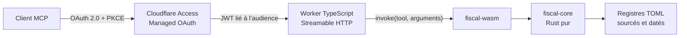

# Impôts France MCP

> Interroger 62 outils fiscaux français depuis un client MCP, avec des calculs Rust et des règles officielles sourcées, datées et versionnées.

[](https://github.com/murillo-consulting/impots-france-mcp/actions/workflows/ci.yml)
[](LICENSE)
[](docs/fiscal-source-audit-2026-08-01.md)

Impôts France MCP couvre notamment l’impôt sur le revenu, le PER, l’IFI, l’immobilier, la transmission, l’épargne, les indépendants, les sociétés, les cryptomonnaies et la fiscalité internationale.

Le dépôt fournit le serveur et son infrastructure de référence. Chaque déploiement configure son propre domaine et sa politique d’accès ; aucun endpoint partagé n’est garanti publiquement.

## Démarrage rapide

Dans un client compatible **MCP Streamable HTTP**, ajouter un serveur personnalisé et remplacer l’URL d’exemple par celle du déploiement :

| Champ | Valeur |
| --- | --- |
| Nom | `Impôts France` |
| Transport | `Streamable HTTP` ou `Diffusion HTTP en continu` |
| URL | `https://mcp.example.com/mcp` |
| Authentification | Cloudflare Managed OAuth |

La connexion ouvre le navigateur pour l’authentification OAuth. L’endpoint renvoie `401 Unauthorized` tant qu’aucun jeton destiné à cette audience n’est présenté.

Premier essai :

```text
Utilise Impôts France pour estimer l’impôt 2026 d’un célibataire avec 50 000 € de revenu net imposable. Donne l’impôt estimé, le taux moyen, le taux marginal, les hypothèses et la version des données.
```

Résultat vérifié avec le registre `2026.08.01` :

```text
Impôt sur le revenu estimé : 8 104 €
Taux moyen : 16,21 %
Taux marginal : 30 %
Période : revenus 2025, déclaration 2026
Audit des données : 1er août 2026
```

Ce résultat est une simulation reproductible, pas un avis fiscal individuel.

## Vérifier un déploiement

1. Confirmer que l’accès anonyme est refusé :

   ```powershell
   $McpUrl = "https://mcp.example.com/mcp"
   curl.exe -i $McpUrl
   ```

   La réponse attendue est `401 Unauthorized`. Un `200 OK` sans authentification indique une régression de sécurité.

2. Lancer [MCP Inspector](https://github.com/modelcontextprotocol/inspector), choisir **Streamable HTTP**, se connecter avec OAuth et vérifier que **62 outils** sont découverts :

   ```powershell
   npx -y @modelcontextprotocol/inspector
   ```

3. Appeler `verifier_actualite_fiscale` avec `annee_cible: 2026`, puis `calculer_impot_revenu` avec le cas du démarrage rapide. Les valeurs de référence sont `incomeTax: 8104`, `averageRatePercent: 16.21`, `marginalRatePercent: 30` et `taxShares: 1`.

Le manifeste [`contracts/tools.json`](contracts/tools.json) décrit les 62 outils, leurs paramètres, leurs valeurs par défaut et leurs énumérations.

## Exemples

```text
Compare le PFU et le barème progressif pour 12 000 € de dividendes, avec 38 000 € d’autres revenus imposables, pour un célibataire sans enfant. Présente les deux scénarios et l’écart estimé.
```

```text
Simule la plus-value sur un logement locatif vendu 310 000 €, acheté 190 000 €, détenu 12 ans, avec 14 000 € de frais d’acquisition réels et 25 000 € de travaux justifiés. Sépare impôt sur le revenu, prélèvements sociaux et avertissements.
```

```text
Calcule la plus-value imposable d’une cession crypto de 20 000 €. Le portefeuille valait 80 000 € avant la cession et son prix total d’acquisition était de 45 000 €. Ajoute 1 200 € de revenus de staking et explicite les hypothèses de calcul.
```

Chaque outil renvoie une réponse Markdown et un `structuredContent` exploitable par le client. Les résultats incluent la version des données, la période d’effet, les hypothèses, les avertissements et les sources officielles utilisées.

## Garanties

- Les 62 contrats d’outils sont versionnés et testés.
- Tous les outils sont déclarés en lecture seule, non destructifs et idempotents.
- Les calculs sont exécutés en Rust, puis compilés en WebAssembly.
- Chaque règle est rattachée à une source officielle et à une période d’effet.
- Les arguments fiscaux et les résultats personnels ne sont pas journalisés.
- Les règles ne sont ni collectées ni modifiées automatiquement en production.

Lorsqu’un résultat dépend d’une commune, d’une convention internationale, d’un agrément ou d’un tarif local, le serveur retourne une limite explicite au lieu d’inventer une valeur.

## Architecture



L’adaptateur TypeScript expose MCP, valide les schémas JSON et contrôle l’accès. Le moteur Rust effectue les calculs à partir des registres TOML.

## Développement

Prérequis : Rust `1.95.0`, Node.js `22` ou supérieur, npm et `wasm-pack`.

```bash
git clone https://github.com/murillo-consulting/impots-france-mcp.git
cd impots-france-mcp
npm ci
npm run build
npm run check
```

`npm run check` vérifie le formatage, Clippy, les tests Rust, les contrats MCP et l’adaptateur TypeScript.

```text
crates/      moteur fiscal Rust et façade Wasm
data/        règles fiscales TOML versionnées
contracts/   contrat public des 62 outils
edge/        serveur MCP Cloudflare Worker
infra/       Access, OAuth et état R2 OpenTofu
docs/        audit des données fiscales
```

Pour déployer une instance, suivre [`infra/README.md`](infra/README.md), tester d’abord l’environnement de staging, puis approuver la production. Ne jamais publier de jeton Cloudflare, d’audience Access ou d’état OpenTofu contenant des secrets.

## Limites, contribution et licence

Ces simulations ne remplacent ni une déclaration préremplie, ni un rescrit, ni un conseil personnalisé. Pour une décision importante, vérifier les textes applicables et solliciter la DGFiP ou un professionnel qualifié.

Toute modification fiscale doit être sourcée, testée et relue. Consulter [`CONTRIBUTING.md`](CONTRIBUTING.md) avant d’ouvrir une pull request.

Ce projet est distribué sous licence [MIT](LICENSE). Les sources fiscales et les dépendances tierces conservent leurs licences respectives.
